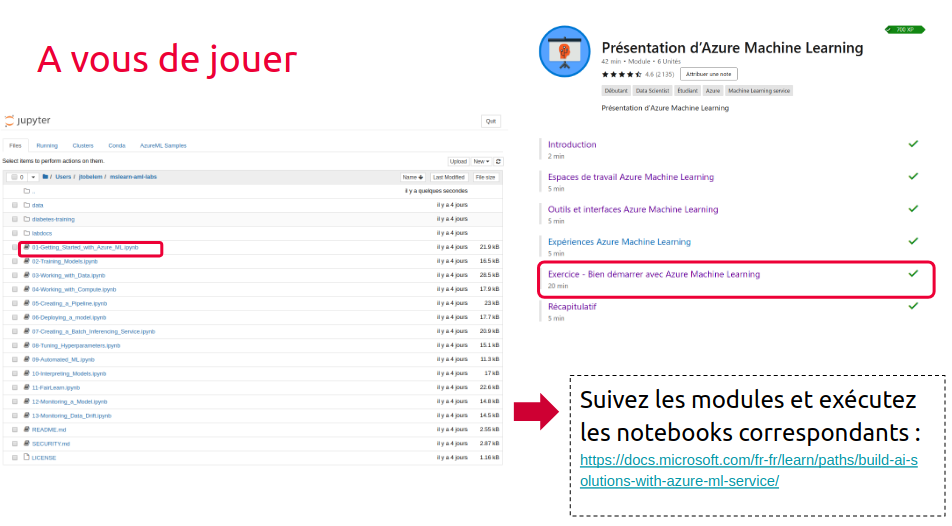

# brief-init

Initialiser un environnement de travail sur la plateforme Azure pour suivre les cours sur le parcours microsoft :
- [Créer des solutions d’IA avec Azure Machine Learning](https://docs.microsoft.com/fr-fr/learn/paths/build-ai-solutions-with-azure-ml-service/)
- [Créer des modèles Machine Learning](https://docs.microsoft.com/fr-fr/learn/paths/create-machine-learn-models/)

La documentation pour ce projet ce trouve [ici](doc/dp100.pdf).

## Livrables

Une capture d'écran comme ci-dessous du studio avec les deux repos installés :
- [mslearn-aml-labs](https://github.com/MicrosoftDocs/mslearn-aml-labs.git)
- [ml-basics](https://github.com/microsoftdocs/ml-basics)

## Référentiels

dp100

## Contexte du projet

Pour initialiser la préparation à la certification dp100, suivez les étapes suivantes :
- connectez-vous à votre workspace Machine Learning dans le groupe de ressources de votre promo
- créez une instance de calcul de type : STANDARD_DS11_V2 (nom : standard-ds11-v2-XX avec XX vos initiales)
- lancez le notebook jupyter depuis cette machine
- lancez un terminal depuis le notebook (menu new)
- allez dans votre dossier (cd Users/XXX)
- clonez https://github.com/MicrosoftDocs/mslearn-aml-labs.git
- clonez https://github.com/microsoftdocs/ml-basics
- suivez maintenant les cours du parcours microsoft et exécutez les notebooks correspondants dans votre environnement configuré

## Modalités pédagogiques

Individuel en autonomie.

## Critère de performance

Avoir complété tous les modules d'apprentissage sur les deux parcours microsoft :
- Créer des solutions d’IA avec Azure Machine Learning : 13 modules
- Créer des modèles Machine Learning : 5 modules

## Modalités d'évaluation

Sur votre poste en montrant à votre formateur votre niveau d'avancement sur les modules d'apprentissage.
